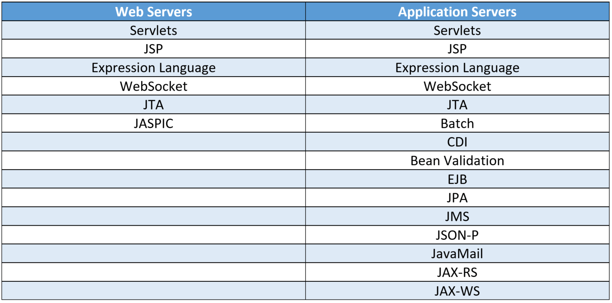

# Lab2_1

## Ex1

O Java Servlet, também conhecido como Jakarta Servlet, é um Java Server Software component, desenhado e *deployed* para melhorar o serviço de um Server, dando upgrade às capacidades para responder a qualquer pedido através de uma Web API.

### Java Servlet Life-Cycle

1. init() </br>
Este método é a fase germinadora de qualquer Java Servlet. Quando um URL específico de um servlet em particular é ativado, o método init() é invocado

2. service() </br>
Este método é a peça central do Life-Cycle do Java Servlet. Logo a seguir à inicialização do Servlet, encontra os requisitos de serviço da parte do cliente

3. destroy
Este método é apenas chamado uma vez durante o Life-Cycle. Quando esta ação é executada, o Servlet faz algumas operações de limpeza como interromper as threads que estão a correr ou em 2º plano, ou fazer uma lista de recuperação de dados relacionados como cookies, guardando-os no disco.

### Vantagens do Java Servlet

* Servlets criam conteúdo dinâmico que torna mais fácil escrever e mais rápido correr documentos;

* Servlets herdam features do java, o que inclui:
    1. Exception handling
    2. Garbage collection
    3. Java Security

* Java Servlets operam em todos os Web Servers, independentemente da plataforma e são highly portable.
* Java Servlets conseguem estabelecer comunicação com outros Servlets e servers

### Disvantagens do Java Servlet

* Desenhar Java Servlets é conhecido por ser complicado.

* Java Servlets são pesados e algumas vezes tornam mais lenta a performance da aplicação.

* Logica de negócio complexa torna a aplicação mais desafiante para dar decode
* É obrigatório ter o JRE no server side para correr servlets.

O Jetty é um web-container

Dependências Lab2_1

```xml        
    <dependency>
        <groupId>org.eclipse.jetty</groupId>
        <artifactId>jetty-server</artifactId>
        <version>9.2.15.v20160210</version>
    </dependency>
   <dependency>
        <groupId>org.eclipse.jetty</groupId>
        <artifactId>jetty-servlet</artifactId>
        <version>9.2.15.v20160210</version>
    </dependency>
```

## Ex2

Vamos usar um Application Server em vez de um WebServer. </br>
Usamos o TomCat e em vez de fazermos download disto, metemos numa imagem através do  docker-compose. </br>
Para lançar as imagens, fazemos ```docker-compose up```



## Ex3

Spring Boot permite criar Spring based Applications, fazendo poucas configurações. </br>
Mais info's: https://spring.io/projects/spring-boot#overview

Podemos usar o Spring Initializr, para gerar por nós um projeto com as depêndencias todas já prontas.

Para além disso, pode ser necesário usar um Maven Wrapper e assim já não é necessário instalar todas as versões específicas do Maven. </br>
Basta ir à main folder do projeto e fazer o comando ```mvn -N wrapper:wrapper```

