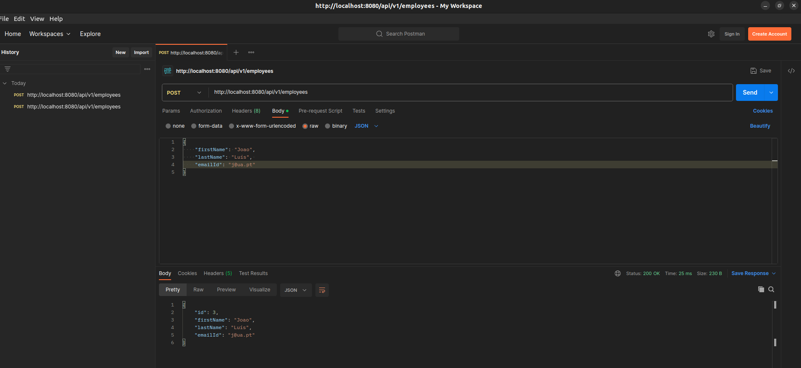
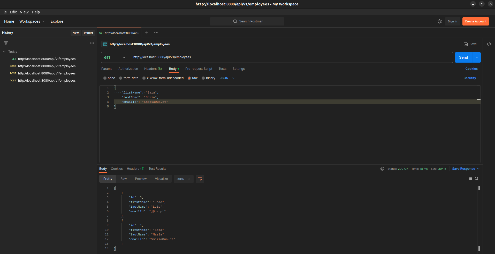
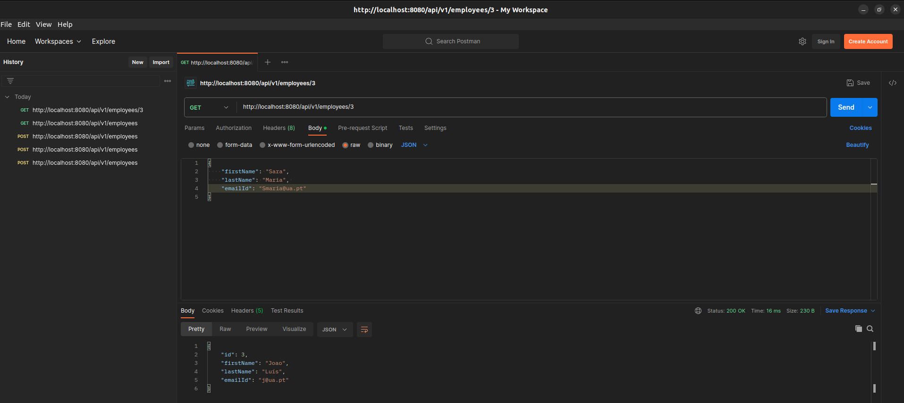
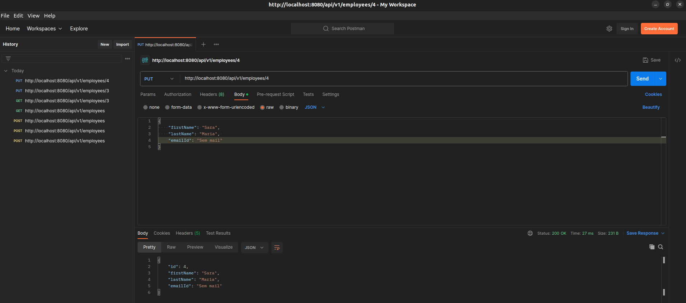
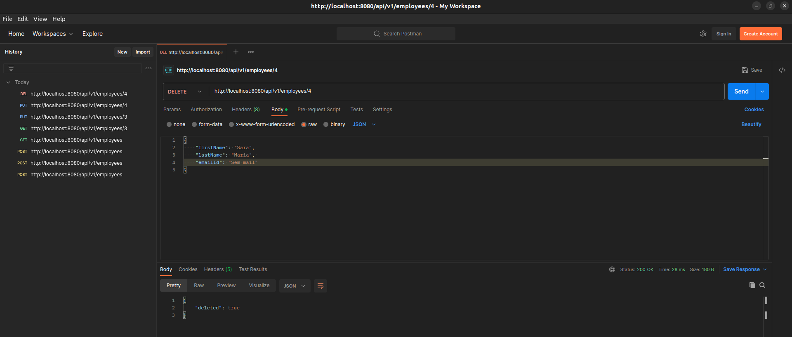

# Lab2_3

## Ex1

### Leitura Sugerida 

Spring Boot vs. Spring MVC vs. Spring

Spring Boot não compete com Spring ou Spring MVC. Torna mais fácil usá-las. </br>

A feature mais importante do Spring FrameWork é a sua Injenção de Dependências, também chamada de Inversão de Controlo (*IOC- Inversion of Control*). </br>
Quando o IOC é usado devidamente, podemos então desenvolver aplicações com pouco *coupling*, o que torna a aplicação mais fácil de ser testada. </br>

O Spring MVC oferece assim uma forma *decoupled* de desenvolver app's web, usando conceito como *Dispatcher Servlet, ModelAndView, and View Resolver*.

Assim, o Spring Boot vem resolver o problema das muitas configurações que são necessárias para o Spring e o Spring MVC. </br>
O Spring Boot tem vários Starter Projects, que trazem já vários componentes a ele associados, dependendo da opção escolhida. </br>

Spring Initializr é a forma mais rápida de criar um projeto Spring Boot

### C) Respostas 

- No construtor da classe UserController, usamos a anotação *@Autowired*, que permite ativar a injeção da dependência do objeto implicitamente. Internamente, é usado injeção através dos *setters* ou construtores.

- Os métodos são o *save()*, *findAll()*, *findById()* e o *delete()*, que são definidos pela classe *CrudRepository*, que por sua vez vai ser extendida pela classe *UserRepository*.

- Os dados estão a ser guardados na *H2database*, que é, por *default* uma base de dados "in-memory".

- A regra que define que o endereço de email não pode ser vazio, está definido na classe *User*, onde colocámos a anotação *@NotBlank* na declaração do atributo Email espeficicando que se trata de um atributo obrigatório

## Ex2

Como para este exercício, temos de usar o MySQl podemos colocar a BD num container docker, fazendo:

```docker
docker run --name mysql5 -e MYSQL_ROOT_PASSWORD=secret1 -e MYSQL_DATABASE=demo -e
MYSQL_USER=demo -e MYSQL_PASSWORD=secret2 -p 33060:3306 -d mysql/mysql-server:5.7
```


Seguindo o tutorial 
https://www.javaguides.net/2018/09/spring-boot-2-jpa-mysql-crud-example.html

Este tutorial usa o Lombok para anotações @Data, que criam por exemplo anotações de *@Getters* e *@Setters*. No entanto, Lombok não é compatível com o JPA, porque a solução é mesmo usar o IDE para gerar os getters e setters e o codigo da classe fica um pouco maior. 

Vamos ter neste exerćicio, uma *@Entity* Employee, um *@Repository* EmployeeRepository, um *@RestController*, que é quem usa as tabelas da base de dados e ainda uma Exception, de *Resource Not Found*, usado para tratar erros que possam aparecer da maneira definida pelo programador.

Para além disso, nota também para a anotação *@Valid* e *@RequestBody*, que fazem com que o corpo do HttpRequest feito, possa ser automaticamente convertido para um objeto Java.

Além disto, tudo, configuramos nos ficheiro application.properties as definições para nos ligarmos à BD, de destacar o comando `spring.jpa.hibernate.ddl-auto = update` para dar update automático aos schemas da BD. <br>
Mais info em https://www.baeldung.com/spring-data-jpa-generate-db-schema

Tive de colocar os comandos `spring.jpa.open-in-view=false` e `spring.jpa.properties.hibernate.globally_quoted_identifiers=true` para resolver o problema da *LazyInitializationException* e de passar nomes de tabelas que não seguem as normas mais padrão, usando aspas para resolver o problema, respetivamente.

Por último, tive de cololcar também o comando`spring.jpa.properties.hibernate.dialect=org.hibernate.dialect.MySQLDialect` nas properties, porque não estava a funcionar por *default*.

#### Testes aos endpoints usando o POSTMAN:

Post 
Get 
Get_ID 
Put_ID 
Delete_ID 

Para fazer a alínea g), em que é passado um parâmetro pelo URL, que pode ser opcional, é preciso fazer o seguinte no nosso código Java:

```Java
@RequestParam(required = false) String email, ...
```

## Ex3 

A API desenvolvida permite fazer os métodos HTTP GET, POST, PUT e DELETE para as Quotes e para os Shows. 

Como, para este exercício, temos 2 serviços, para correr isto no Docker vamos ter de fazer um Docker Compose.

A app corre ela própria num DockerFile, mas neste momento, dá *build failed.*

De notar que criei um ficheiro .env para configuração das variáveis de ambiente, e que não está no Repositório remoto pois tem informações sensíveis e que não devem estar em repo's remotos. 
A informação do MySQL está a ser guardada num volume do docker.

Para iniciar o processo, fiz `docker-compose up`.
Testei os endpoints da API através do PostMan, fazendo ,por exemplo, 
 
No final, para não ficar com qualquer container ou imagem que estava a ser usado pelo docker compose, fiz o comando `docker-compose down --rmi all`


